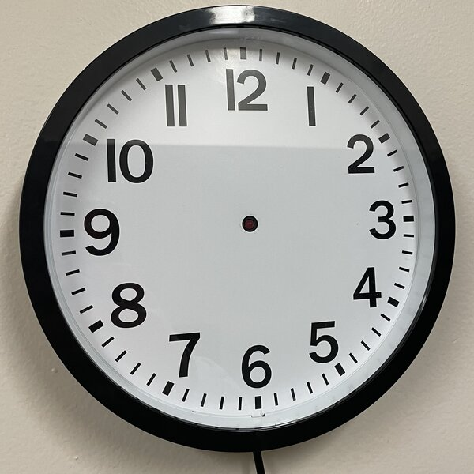
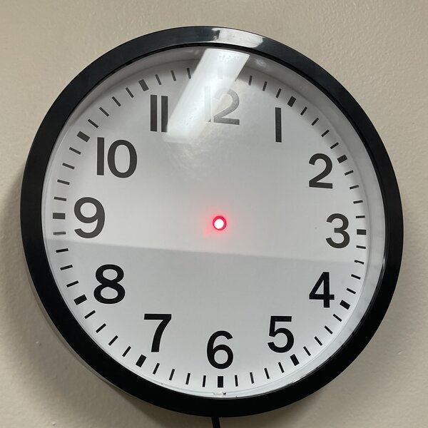

# Prime-Time
The most useless clock in the world! When the number of seconds elapsed since midnight on January 1st is prime, the Arduino lights up an LED mounted inside a clock. What time is it? Dunno, but it's prime time!

Below: A non-prime time (boo!)

Below: Prime time (yay!)

