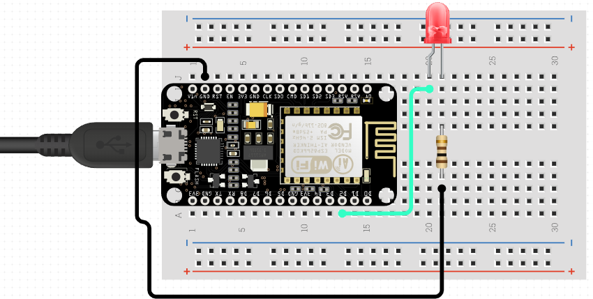

# Setup

## Arduino IDE

Follow [this guide](https://randomnerdtutorials.com/how-to-install-esp8266-board-arduino-ide/) to install the necessary drivers to program ESP8266 boards. Then, select the board marked "NodeMCU 1.0 (ESP - 12E Module)". Set the serial monitor's baud rate to 115200 if running in debug mode (activated by defining `PT_DEBUG`).

## Wiring

The wiring for this project is extremely simple and shown in the schematic below. 

Be sure to select a value for the resistor that matches your LED and output voltage. I believe I selected a resistor with a value of approximately 100Ω, calculated as shown below. $V_s$ is the supply voltage, $V_f$ is the LED's forward voltage, and $I_f$ is the LED's forward current.

$$R=\frac{V_s-V_f}{I_f}=\frac{3.3V-2.0V}{0.02A}=65Ω$$

I decided to go with a higher value than this minimum because I knew that I didn't want the clock's LED running at full 20 mA blast all the time; about half of the maximum brightness was just fine.